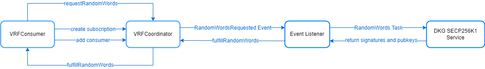

## About VRF

The on-chain random number of PlatON comes from the Nonce field in the block header, which uses the Nonce of the parent block as the seed and generates the random number with the private key signature of the proposer of the current block. In practical use, the [1,33] byte of this field can be taken as the random source of the verifiable random number.

Giskard, PlatON’s consensus algorithm, uses the VRF algorithm to select validators, and its on-chain Nonce (VRF and proof) is inherently secure, verifiable, random, and non-tamperable. Since all validators in the PlatON network will verify the Nonce field in the block header, this field will also be applied to the random selection of PlatON consensus nodes, the security of which has been fully proved.

We launched `VRF V1` version. In this version, we refer to Chainlink's subscription model and provide a developer-friendly VRF service on PlatON based on the use of PlatON's built-in random numbers. Soon, we will release an off-chain MPC version of VRF based on this version, and developers will not need to make major changes to their contracts.

The brief contract structure design is as follows:

## How to use

[VRFConsumer.sol](https://github.com/realran/VRFContract/blob/main/sample/VRFConsumer.sol) is a sample contract, you can refer to this contract and do the following steps to easily enable VRF integration :

1. Get the `VRFCoordinator` address based on the network in the and update the `vrfCoordinator` address in the  `VRFConsumer.col`.
2. Deploy the `VRFConsumer.col` contract. This example contract includes the `createNewSubscription()` function in the `constructor()` that creates the subscription and adds itself as a consumer automatically when you deploy it.
3. Call the `syncRequestRandomWords()` function in the `VRFConsumer.col` contract to synchronously get random values.
4. Or call the `requestRandomWords()` function in the `VRFConsumer.col` contract to asynchronously request random values which are returned via the callback function `fulfillRandomWords()`.

For more, please refer to：[Get a Random Number](https://docs.realran.com/Docs/Getting%20Started/Get%20a%20Random%20Number)

## License

[MIT](https://choosealicense.com/licenses/mit/)

